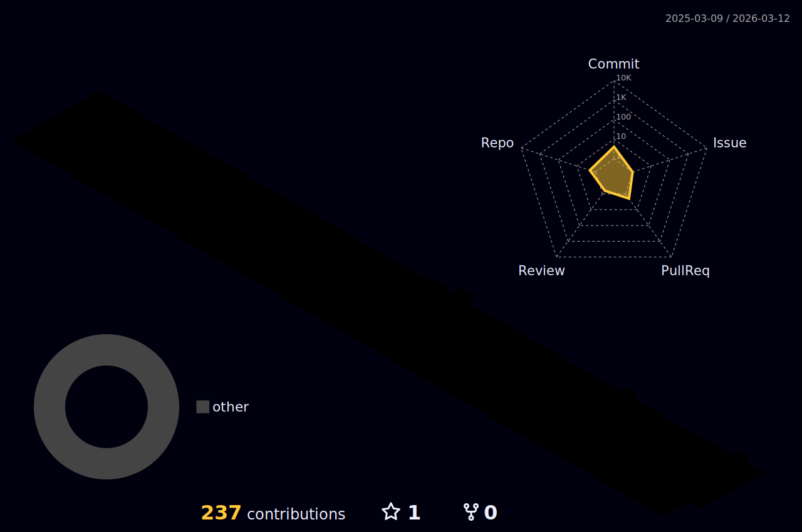

  <picture>
    <source media="(prefers-color-scheme: dark)" srcset="https://readme-typing-svg.herokuapp.com?font=Roboto&weight=600&size=40&duration=2000&pause=500&color=FF6B35&center=true&vCenter=true&multiline=true&width=500&height=150&lines=Hi%2C+my+name+is;John+Fevre;I+build+things+in+the+cloud.">
    <source media="(prefers-color-scheme: light)" srcset="https://readme-typing-svg.herokuapp.com?font=Roboto&weight=600&size=40&duration=2000&pause=500&color=1F5F1F&center=true&vCenter=true&multiline=true&width=500&height=150&lines=Hi%2C+my+name+is;John+Fevre;I+build+things+in+the+cloud.">
    
  </picture>

  
  
  

  Cloud Engineer with 10+ years in infrastructure and DevOps. 
  I specialise in AWS, Terraform, and CI/CD. 
  Building serverless AI applications, automating everything cloud related and performing enterprise data centre migrations.

---

<!--
### What I'm Working On

- Built a bulk image analyser using AWS Bedrock Nova Lite to generate alt text, labels, and descriptions for millions of images
- Building reusable Terraform modules and CI/CD pipelines
- Running a home lab with Unraid, Home Assistant, Ansible, and Docker

---
-->

### Tools of the trade

  <picture>
    <source media="(prefers-color-scheme: dark)" srcset="https://skillicons.dev/icons?i=aws,terraform,docker,ansible,linux,windows,py,github,githubactions,bitbucket&theme=dark">
    <source media="(prefers-color-scheme: light)" srcset="https://skillicons.dev/icons?i=aws,terraform,docker,ansible,linux,windows,py,github,githubactions,bitbucket&theme=light">
    
  </picture>

---

<b>Certifications</b>

 

  
  
  
  
  

---

<picture>
  <source media="(prefers-color-scheme: dark)" srcset="./profile-3d-contrib/profile-night-rainbow.svg">
  <source media="(prefers-color-scheme: light)" srcset="./profile-3d-contrib/profile-green.svg">
  
</picture>
